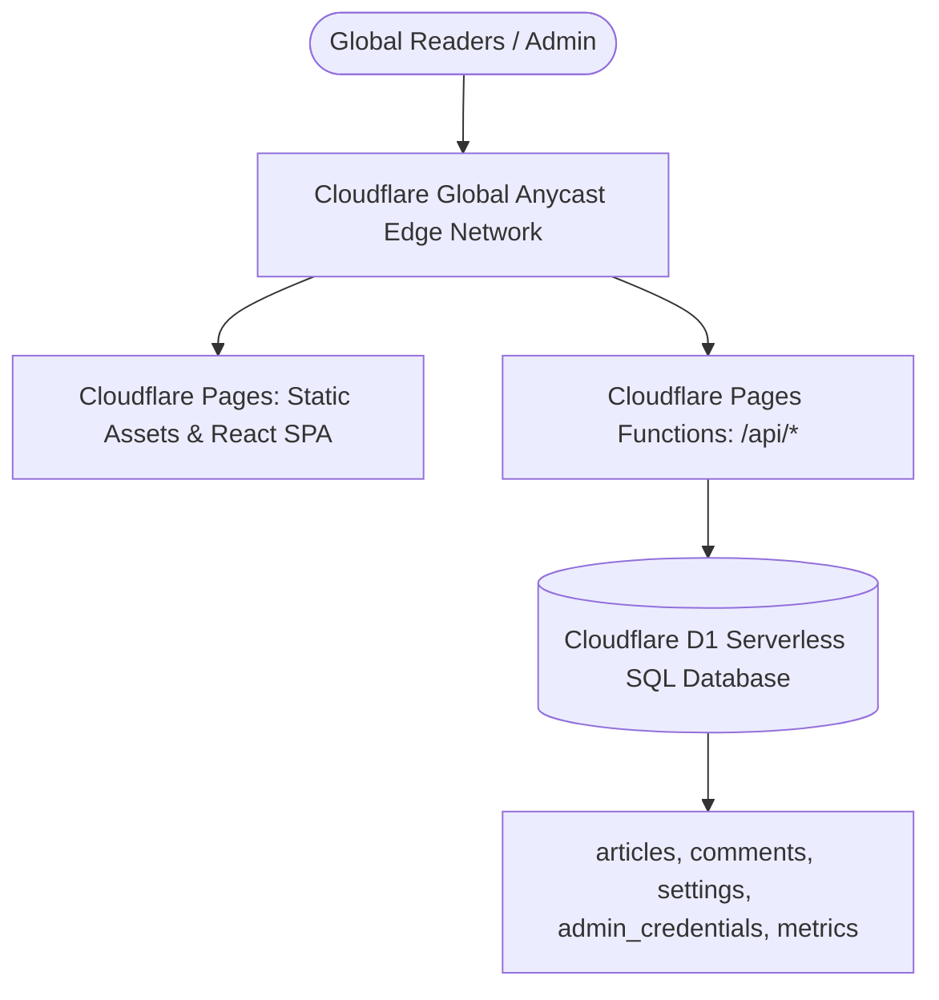

# Cloudflare Deployment & D1 Relational SQL Database Guide

This guide explains how to deploy **THE VANGUARD JOURNAL** to **Cloudflare Pages** with **Cloudflare D1 (Serverless Relational SQL Database)** for zero-cost, infinite scalability, and multi-year production resilience.

---

## 🏛️ Architecture Overview



### Why This Is Ideal for Cloudflare:
- **Free Unlimited Bandwidth & Edge CDN** via Cloudflare Pages.
- **Relational SQL Database** (Cloudflare D1) with standard SQL tables, foreign keys, and indexes.
- **5 GB Free Database Storage** (stores over 250,000+ deep research articles).
- **5 Million Reads / Day & 100,000 Writes / Day** included in Cloudflare's free tier.
- **Zero Server Maintenance:** No MySQL patching, no Apache restarts, 99.99% edge uptime.

---

## 🚀 Step-by-Step Deployment Instructions

### Prerequisites
Make sure you have Node.js and npm installed (already on your machine).
Log in to your Cloudflare account or create a free account at [cloudflare.com](https://dash.cloudflare.com).

---

### Step 1: Install Wrangler CLI (if not already installed)
In your terminal, navigate to this project folder:
```bash
cd c:\xampp\htdocs\the-vanguard
npm install --save-dev wrangler
```

Authenticate Wrangler with your Cloudflare account:
```bash
npx wrangler login
```
*(This will open your browser to authorize Wrangler with one click).*

---

### Step 2: Create Your Cloudflare D1 Database
Create the production D1 database:
```bash
npx wrangler d1 create the_vanguard_db
```

Wrangler will output something like:
```toml
[[d1_databases]]
binding = "DB"
database_name = "the_vanguard_db"
database_id = "a1b2c3d4-e5f6-7890-abcd-ef1234567890"
```

Open `wrangler.toml` in your project and replace `"your-d1-database-id-here"` with your actual `database_id`:
```toml
[[d1_databases]]
binding = "DB"
database_name = "the_vanguard_db"
database_id = "a1b2c3d4-e5f6-7890-abcd-ef1234567890"
```

---

### Step 3: Initialize the Relational SQL Tables
Execute the provided `schema.sql` file to create your tables and initial indexes in Cloudflare D1:
```bash
npx wrangler d1 execute the_vanguard_db --remote --file=./schema.sql
```

Your database is now created with:
- `articles` table (indexed by category, status, published date, slug)
- `comments` table (with cascade delete foreign key)
- `settings` table
- `admin_credentials` table (default: `admin` / `admin123`)
- `metrics` table

---

### Step 4: Build & Deploy to Cloudflare Pages

#### Option A: Direct Command-Line Deployment
1. Build the production bundle:
   ```bash
   npm run build
   ```
2. Deploy directly to Cloudflare Pages:
   ```bash
   npx wrangler pages deploy dist --project-name=the-vanguard
   ```
3. Link the D1 database binding in the Cloudflare Dashboard:
   - Go to **Cloudflare Dashboard** → **Workers & Pages** → select **the-vanguard**.
   - Navigate to **Settings** → **Functions** → **D1 database bindings**.
   - Click **Add binding**:
     - Variable name: `DB`
     - D1 database: `the_vanguard_db`
   - Click **Save**.

#### Option B: Automated Git Push Deployment (Recommended)
1. Push your repository to GitHub or GitLab:
   ```bash
   git init
   git add .
   git commit -m "Deploy The Vanguard with Cloudflare D1"
   git remote add origin https://github.com/your-username/the-vanguard.git
   git push -u origin main
   ```
2. In **Cloudflare Dashboard**:
   - Go to **Workers & Pages** → **Create application** → **Pages** → **Connect to Git**.
   - Select your repository.
   - Build settings:
     - Framework preset: `Vite`
     - Build command: `npm run build`
     - Build output directory: `dist`
   - Under **Settings** → **Functions** → **D1 database bindings**, bind `DB` to `the_vanguard_db`.
   - Every time you push a commit, Cloudflare will automatically build and deploy your site worldwide!

---

## 🛠️ Verification & API Testing

Once deployed, your Cloudflare Pages URL (e.g. `https://the-vanguard.pages.dev`) will serve:
- The React application from the Edge CDN.
- The serverless REST API endpoints automatically at:
  - `GET https://your-site.pages.dev/api/articles?page=1&limit=20`
  - `POST https://your-site.pages.dev/api/articles`
  - `GET https://your-site.pages.dev/api/settings`
  - `POST https://your-site.pages.dev/api/auth`

---

## 🔄 Disaster Recovery & Local Development
- You can export a snapshot of your Cloudflare D1 database anytime:
  ```bash
  npx wrangler d1 export the_vanguard_db --remote --output=./backup.sql
  ```
- Or use the one-click **Download Backup (JSON)** button in the Admin Dashboard!
